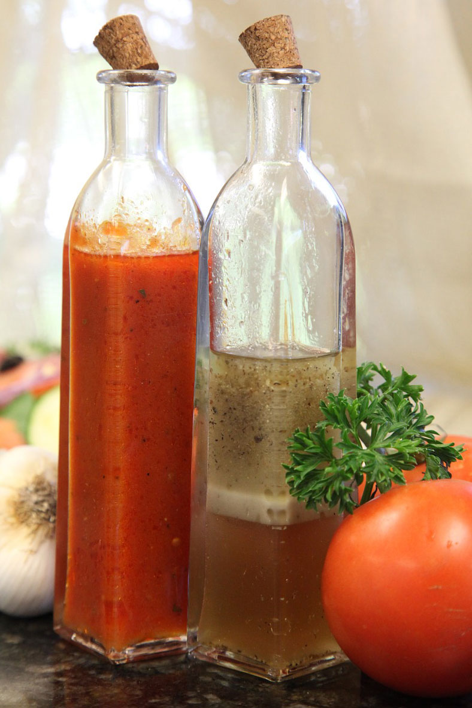
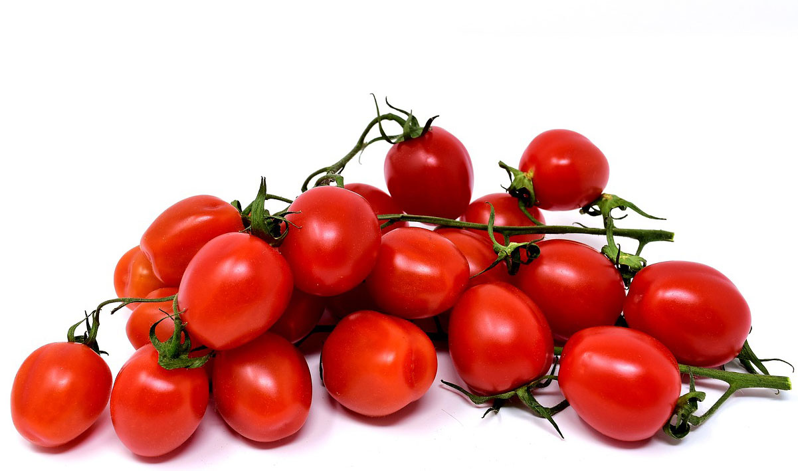

Imagine a steaming hot spring roll, fried chicken, grilled chicken, chicken wings, chicken nuggets, hamburger etc. etc. All of these things taste MUCH better with some extra heat, don't you think?! In this post you find a simple hot sauce recipe. It makes use of the sweetness of tomatoes and sourness, as well as sweetness, from apples. 

See my Delicious [Carolina Reaper Syrup](https://capsicumboy.github.io/Delicious-Carolina-Reaper-Chili-Syrup/) Recipe for more uses of chili peppers!

### Ingredients
1 kg of ripe tomatoes
1 sour apple
2 small yellow onions
3-4 cloves garlic or 1 garlic Solo
1 cup water
1 dl of white wine vinegar
1 dl granulated Sugar
1 tsp of Colman mustard powder
1 tbsp paprika
1 tbsp chili powder
1 tsp salt 

### Instructions
Start by wash your chili peppers and tomatoes. 
Now it's time to scald the tomatoes in hot water. This makes it easier to peel them. When you have removed the peel you should remove the tomatoe seeds. 
Cut the tomatoes into pieces. Now it's time to peel, remove the apple core and dice the apple. Dice and peel the garlic and onions. 

Add everything in a pot together with water and let it simmer under a lid for about 15 minutes. 

Pour the mixture into a blender and run until everything is finely divided, or pass through a fine mesh strainer. Pour the sauce mix back into the pot and add the remaining ingredients. 

Simmer, stirring occasionally for 5 minutes. Pour in hot, well-cleaned bottles or cans. Seal. Let stand in the fridge for a couple of weeks to mature before it is eaten.
