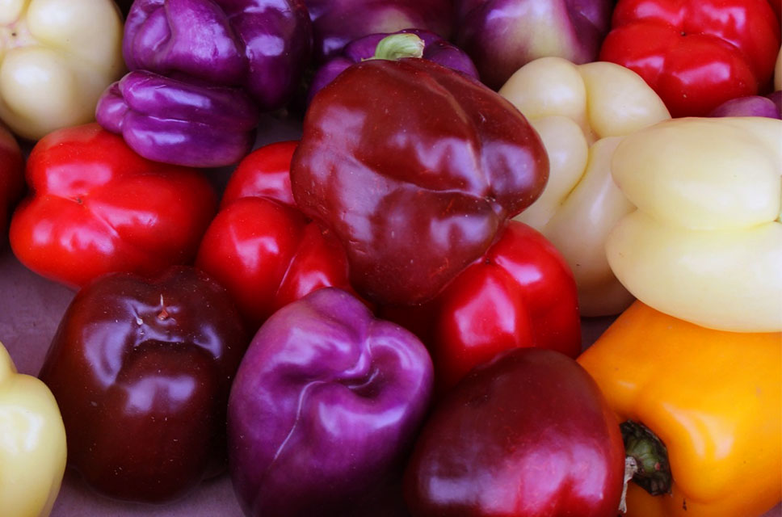
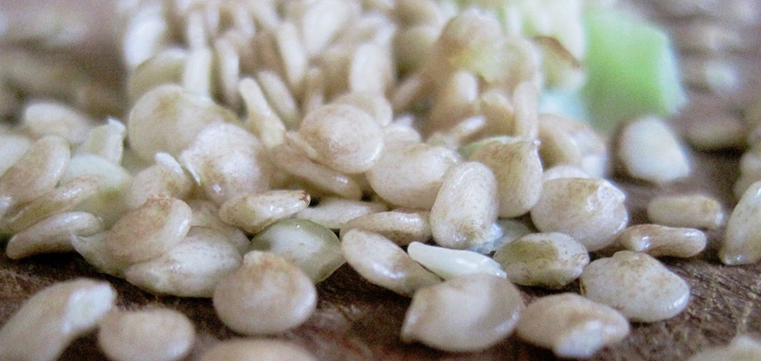

## How to Grow Bell Peppers at Home
There are many species of pepper that don't grow particularly high, but still produces great fruits. These varieties are ideal vegetables to grow at home on the window sill. You can have multiple plants in the same window, and they thrive very well together with different types of peppers. This is because they are related to each other and have similar preferences and growth habits.

There are also a number of bell pepper varieties that grows very large. These can be appropriate in the corner of the balcony but does not fit well for indoor growing. Therefore, be careful to choose the right types. Avoid buying unlabeled seedlings if the salesperson can't say exactly what variety it is.

See also my post, including a video, [The Ultimate Guide How to Grow Bell Peppers](https://capsicumboy.github.io/the-ultimate-guide-to-growing-bell-peppers/) for a great audiovisual guide.

## How to Select the Right Bell Pepper to Grow
Bell peppers can have a different color depending on how ripe they and depending on what type they belong to. 

See [here](https://www.grow-it-organically.com/pepper-varieties.html) for information about different bell pepper varieties.

Some peppers will become red no matter how long you let them mature. Other types of bell peppers can continue to ripen on the plant when they are red and become purple or almost black. What color of a pepper has depends on both the type and degree of ripeness.

This is something you should take into consideration when you are choosing which type of pepper want grow. Usually it is best to choose a pepper that can be harvested as red, (orange), yellow, or green. This gives you the most variety when you harvest. That is, you can harvest green, yellow, or red bell peppers! 

If you only think about one color of peppers, however, it can be better to choose a type that is not maturing past this color. This way you don't to get a pepper where one side is red before the other has turned yellow.

If you want to grow white, black or another less traditional color, you must select the specific types of peppers. The same applies if you want peppers with forms other than the classic bell pepper. I prefer the long narrow peppers that gives small thin slices. I find that these are much easier to cut and work with because the seed part is only a small part of the fruit.

Remember to try to choose a low growing peppers that fit into your home. That is, if you are planning on growing bell peppers on the window sill, choose vareties that don't grow that tall.

## Where to Get Bell Pepper Seeds
The absoletely easiest way is to buy a pepper plant. This is also more convenient but it also much more expensive and it can be difficult to get the types of peppers you want. If you want to grow cheap food, you should always start from seed. This is particularly true since it is easy to get the seeds bought from the supermarket to germinate.

I always choose to start from seed for the simple reason that the supply of different types of plants are always too small. It is impossible for a nursery to offer even a fraction of the range of types you get access to if you start from seeds.

To germinate bell pepper seeds is very easy and they germinate very readily. It usually takes only a few days before you see the small plants. The young plants can unfortunately be a little sensitive. However, they are not hard to take care of but it is very important that they don't get too dry. The small plants can grow very slowly if they do not receive proper care. Try to make them a bit brighter if this is the case. They shall not be fattening before they are 15 cm high.

- See [this](http://www.tradewindsfruit.com/content/seed-germination-tips.htm) post for some nice information of seed germination. 

- [Growing Red Bell Peppers from Seed](https://capsicumboy.github.io/Growing-Red-Bell-Peppers-From-Seed/)

## How to Care for Bell Pepper Plants
Bell pepper plants are very easy to care for when they have crossed a certain size. Before this, they can as mentioned above be a little knocks knopp knot knots knotted. They want to be watered regularly so that they do not dry out completely but also do not want to be soaked. Use well drained soil so that the roots are never left standing in water. It is usually better that they are a little too dry than they are wet.

### Fertilzing Bell Peppers
They should be fertilized approximately every 14 days with a balanced fertilizer. (20-20-20 [N-P-K](https://en.wikipedia.org/wiki/Labeling_of_fertilizer), is a good fertilzer). If you are using an unbalanced fertilizer can you get too much leave growth but no peppers, or the plant to stop growing too early and is fully focused on giving you the fruit. This gives a smaller harvest.

Bell pepper plants need relatively much space and I would recommend that you plant them in a pot that is minimum 20 cm. To give them room to create a large rotverk reduces the growth early in the season but will give you a more durable plant. Something that can be good when you grow them on the window sill.

If you get infested with Fungus Gnats, I've written a post on how to fight them off: [Fighting Fungus Gnats](https://capsicumboy.github.io/Fighting-Fungus-Gnats-from-Your-Growing-Peppers/)

## Over-wintering Bell Peppers
There are some pepper types that can live for several years and continuously produce peppers. Most types, however, is developed to provide a harvest during the a season and then die. More modern types are often developed for a shorter, more intense life cycle. If you want to have a bell pepper variety that you can hibernate and enjoy in several years, you should instead primarily look to the different types of Heirloom sweet peppers. These are more likely to be able to hibernate. 

If you are interested in growing hot peppers see [here]()

